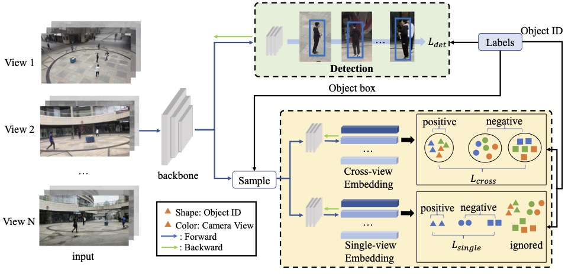

# CrossMOT

## Framework


## Installation
## Dependencies
* Python 3.8
* PyTorch >= 1.7.0

## Environment Setup
```
conda create -n CrossMOT python=3.8
conda activate CrossMOT
conda install pytorch==1.7.0 torchvision==0.8.0 cudatoolkit=10.2 -c pytorch
cd ${CrossMOT_ROOT}
pip install cython
pip install -r requirements.txt
```

## DCNv2 Backbone Network
We use [DCNv2_pytorch_1.7](https://github.com/ifzhang/DCNv2/tree/pytorch_1.7) in our backbone network (pytorch_1.7 branch). Previous versions can be found in [DCNv2](https://github.com/CharlesShang/DCNv2).

```
git clone -b pytorch_1.7 https://github.com/ifzhang/DCNv2.git
cd DCNv2
./make.sh
```

## Data preparation
Datasets
We use five cross-view MOT datasets:
* [EPFL](https://www.epfl.ch/labs/cvlab/data/data-pom-index-php/)
* [DIVOTrack](https://github.com/shengyuhao/DIVOTrack)
* [MvMHAT](https://github.com/realgump/MvMHAT), [CAMPUS](http://web.cs.ucla.edu/~yuanluxu/research/mv_track.html)
* [CAMPUS](http://web.cs.ucla.edu/~yuanluxu/research/mv_track.html)
* [Wildtrack](https://www.epfl.ch/labs/cvlab/data/data-wildtrack/)

Visit their official websites to download the images and annotations. After downloading the datasets, please put all the images in `{CrossMOT_root}/dataset/dataset_name/images`. Make sure the name of each image follows the format `{scene_name}_{view_name}_{frame_id}.jpg`. Then, use the annotation file and `{CrossMOT_root}/src/dataset_util/` to generate the corresponding training file {dataset_name}.train and store it in `{CrossMOT_root}/src/data/`.

## Directory Structure
Before training, the dataset should have the following structure:

```
${dataset_name}
   ├── images
   │   └── train
   └── labels_with_ids
       ├── train
       └── test

```


## Pretrained model

We use the prertained model of [FairMOT](https://github.com/ifzhang/FairMOT) The models can be downloaded here: fairmot_dla34.pth [[Google]](https://drive.google.com/file/d/1iqRQjsG9BawIl8SlFomMg5iwkb6nqSpi/view?usp=sharing) [[Baidu, code:uouv]](https://pan.baidu.com/s/1H1Zp8wrTKDk20_DSPAeEkg) [[Onedrive]](https://microsoftapc-my.sharepoint.com/:u:/g/personal/v-yifzha_microsoft_com/EWHN_RQA08BDoEce_qFW-ogBNUsb0jnxG3pNS3DJ7I8NmQ?e=p0Pul1).

After downloading, place the baseline model in the following structure:
```
${CrossMOT_ROOT}
   └── models
       └── fairmot_dla34.pth
```

## Training
1. Download the training data.
2. Change the dataset root directory `root` in `src/lib/cfg/data.json` and `data_dir` in `src/lib/opts.py`.
3. Run the appropriate command for the dataset you want to train:

### Train DIVOTrack
```
sh ./experiments/train_divo.sh
```

### Train MvMHAT
```
sh ./experiments/train_mvmhat.sh
```
### Train Campus
```
sh ./experiments/train_campus.sh
```
## Tracking
For tracking, you only need to specify the tracking model by running the following command:
```
cd src
python track.py mot --load_model {your path to the tracking model} --test_divo --conf_thres 0.5 --reid_dim 512 --track_name {your exp name}
```
You can download our model from [this link](https://drive.google.com/file/d/1mQyw7F-V8_Btms5ifXSpIagBzcWoVuRP/view?usp=share_link).
## Ablation Study 
You can modify the training or tracking settings to reproduce our ablation study. The instructions are as follows:

## Training Options
* `--baseline`: Set this to 1 for the shared embedding experiment. You need to further specify --baseline_view: 0 for single-view embedding, 1 for cross-view embedding.
* `--single_view_id_split_loss`: Use this to achieve single-view conflict-free loss.
* `--cross_view_id_split_loss`: Use this to achieve cross-view conflict-free loss.
* `--reid_dim`: Set the dimension of single-view and cross-view embeddings.
* `--zero_start`: Set this to if the person ID in the dataset start with zero.


## Tracking Options
* `--conf_thres`: Set the detection threshold. Default is 0.5.
* `--single_view_threshold`: Set the single-view association threshold. Default is 0.3.
* `--cross_view_threshold`: Set the cross-view association threshold. Default is 0.5.
