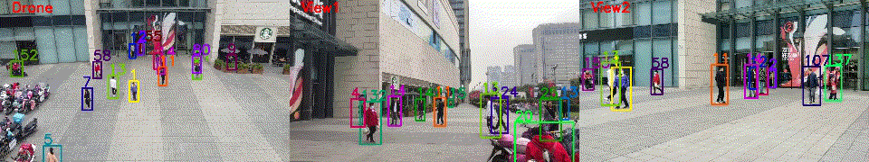
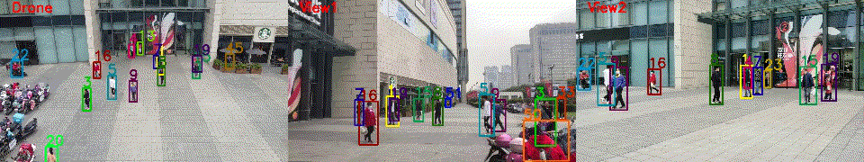

# DIVOTrack: A Novel Dataset and Baseline Method for Cross-View Multi-Object Tracking in DIVerse Open Scenes
[](https://arxiv.org/abs/2302.07676)
[](https://huggingface.co/datasets/syhao777/DIVOTrack)

This repository contains the details of the dataset and the Pytorch implementation of the Baseline Method CrossMOT of the Paper:
[DIVOTrack: A Novel Dataset and Baseline Method for Cross-View Multi-Object Tracking in DIVerse Open Scenes](https://arxiv.org/abs/2302.07676)


## Abstract
Cross-view multi-object tracking aims to link objects between frames and camera views with substantial overlaps. Although cross-view multi-object tracking has received increased attention in recent years, existing datasets still have several issues, including 1) missing real-world scenarios, 2) lacking diverse scenes, 3) owning a limited number of tracks, 4) comprising only static cameras, and 5) lacking standard benchmarks, which hinder the investigation and comparison of cross-view tracking methods. To solve the aforementioned issues, we introduce **DIVOTrack**: a new cross-view multi-object tracking dataset for **DIV**erse **O**pen scenes with dense tracking pedestrians in realistic and non-experimental environments. Our DIVOTrack has ten distinct scenarios and 953 cross-view tracks, surpassing all cross-view multi-object tracking datasets currently available. Furthermore, we provide a novel baseline cross-view tracking method with a unified joint detection and cross-view tracking framework named CrossMOT, which learns object detection, single-view association, and cross-view matching with an all-in-one embedding model. Finally, we present a summary of current methodologies and a set of standard benchmarks with our DIVOTrack to provide a fair comparison and conduct a comprehensive analysis of current approaches and our proposed CrossMOT.


- **<a href="#des"> <u>Dataset Description</u>**</a>
  - **<a href="#str"> <u>Dataset Structure</u>**</a>
  - **<a href="#dow"> <u>Dataset Downloads</u>**</a>
- **<a href="#det"> <u>Training Detector</u>**</a>
- **<a href="#sin"> <u>Single-view Tracking</u>**</a>
- **<a href="#cro"> <u>Cross-view Tracking</u>**</a>
- **<a href="#ref"> <u>Reference</u>**</a>
- **<a href="#con"> <u>Contact</u>**</a>

The test result of the cross-view MOT baseline method *MvMHAT* on the DIVOTrack. 


The ground truth of the DIVOTrack.


## <a id="des">Dataset Description</a>
We collect data in 10 different real-world scenarios, named: `'Circle', 'Shop', 'Moving', 'Park', 'Ground', 'Gate1', 'Floor', 'Side', 'Square', and 'Gate2'`. All
the sequences are captured by using 3 moving cameras: `'View1', 'View2', 'View3'` and are manually synchronized. 

In the old version, the corresponding scenarios named: `'circleRegion', 'innerShop', 'movingView', 'park', 'playground', 'shopFrontGate', 'shopSecondFloor', 'shopSideGate', 'shopSideSquare', 'southGate'`. The corresponding camera is named: `'Drone', 'View1', 'View2'`.

For the test set, we provide the ground truth of the 5 scenes: `'Circle', 'Gate1', 'Floor', 'Shop', and 'Square'`.
### <a id="str">Dataset Structure</a>
The structure of our dataset is as follows:
```
DIVOTrack
    └─────datasets
             └─────DIVO
                    ├───images
                    │    ├───annotations
                    │    ├───dets
                    │    ├───train
                    │    └───test
                    ├───labels_with_ids
                    │    ├───train
                    │    └───test
                    ├───ReID_format
                    │    ├───bounding_box_test
                    │    ├───bounding_box_train
                    │    └───query
                    └───boxes.json

```
### <a id="dow">Dataset Downloads</a>
The whole dataset can be downloaded from [Huggingface](https://huggingface.co/datasets/syhao777/DIVOTrack). **Note that, each file needs to unzip by the password. You can decompress each `.zip` file in its folder after sending us (shengyuhao@zju.edu.cn, gaoangwang@intl.zju.edu.cn) the License in any format.** After that, you should run `generate_ini.py` to generate `seqinfo.ini` file. 

## <a id="det">Training Detector</a>
The training process of our detector is in `./Training_detector/` and the details can be seen from  [Training_detector/README.md](https://github.com/shengyuhao/DIVOTrack/tree/main/Training_Detector#readme).
## <a id="sin">Single-view Tracking</a>
We conducted experiments on DIVOTrack in five benchmarks:

| Benchmark | HOTA ↑ | IDF1 ↑ | MOTA ↑ | MOTP ↑ | MT ↑ | ML ↓ | AssA ↑ | IDSw ↓ | FM ↓ |
| --------- | ------ | ------ | ------ | ------ | ---- | ---- | ------ | ------ | ---- |
| [DeepSort](./Single_view_Tracking/Deepsort/)       | 54.3 | 59.9 | 79.6 | 81.2 | 462 | 50 | 45.0 | 1,920 | **2,504** |
| [CenterTrack](./Single_view_Tracking/CenterTrack/) | 55.3 | 62.2 | 73.4 | 80.6 | **534** | 35 | 49.2 | 1,631 | 2,950 |
| [Tracktor](./Single_view_Tracking/Tracktor/)       | 48.4 | 56.2 | 66.6 | 80.8 | 517 | **22** | 40.3 | 1,382 | 3,337 |
| [FairMOT](./Single_view_Tracking/FairMOT/)         | **65.3** | **78.2** | **82.7** | 81.9 | 486 | 48 | **62.7** | 731   | 3,498 |
| [TraDeS](./Single_view_Tracking/TraDeS/)           | 58.9 | 67.3 | 74.2 | **82.3** | 504 | 38 | 54.0 | 1,263 | 2,647 |

Each single-view tracking baseline is evaluated using [TrackEval](https://github.com/shengyuhao/DIVOTrack/tree/main/TrackEval#readme).

## <a id="cro">Cross-view Tracking</a>
We conducted experiments on the DIVOTrack dataset using six benchmarks as well as our proposed method [CrossMOT](./CrossMOT/)
| Benchmark | CVMA ↑ | CVIDF1 ↑ |
| --------- | ------ | -------- |
| [OSNet](./Cross_view_Tracking/OSNet/)       | 34.3 | 46.0 |
| [Strong](./Cross_view_Tracking/StrongReID/) | 40.9 | 45.9 |
| [AGW](./Cross_view_Tracking/AGW/)           | 57.0 | 56.8 |
| [MvMHAT](./Cross_view_Tracking/MvMHAT/)     | 61.0 | 62.6 |
| [CT](./Cross_view_Tracking/CT/)             | 64.9 | 65.0 |
| [MGN](./Cross_view_Tracking/MGN/)           | 33.5 | 39.4 |
| [CrossMOT](./CrossMOT/)                     | **72.4** | **71.1** |

With the exception of CrossMOT, all of the other Re-ID methods require [Multi_view_Tracking](https://github.com/shengyuhao/DIVOTrack/tree/main/Multi_view_Tracking#readme) to predict the tracking results after they are obtained. Finally, the results of CVMA and CVIDF1 are obtained through [MOTChallengeEvalKit_cv_test](https://github.com/shengyuhao/DIVOTrack/tree/main/MOTChallengeEvalKit_cv_test#readme).


## <a id="ref">Reference</a>
Any use whatsoever of this dataset and its associated software shall constitute your acceptance of the terms of this agreement. By using the dataset and its associated software, you agree to cite the papers of the authors, in any of your publications by you and your collaborators that make any use of the dataset, in the following format:
```
@article{hao2024divotrack,
  title={Divotrack: A novel dataset and baseline method for cross-view multi-object tracking in diverse open scenes},
  author={Hao, Shengyu and Liu, Peiyuan and Zhan, Yibing and Jin, Kaixun and Liu, Zuozhu and Song, Mingli and Hwang, Jenq-Neng and Wang, Gaoang},
  journal={International Journal of Computer Vision},
  volume={132},
  number={4},
  pages={1075--1090},
  year={2024},
  publisher={Springer}
}
```
The license agreement for data usage implies the citation of the paper above. Please notice that citing the dataset URL instead of the publications would not be compliant with this license agreement. You can read the LICENSE from [LICENSE](https://github.com/shengyuhao/DIVOTrack/blob/main/LICENSE.md).

## <a id="con">Contact</a>
If you have any concerns, please contact [shengyuhao@zju.edu.cn](shengyuhao@zju.edu.cn)
